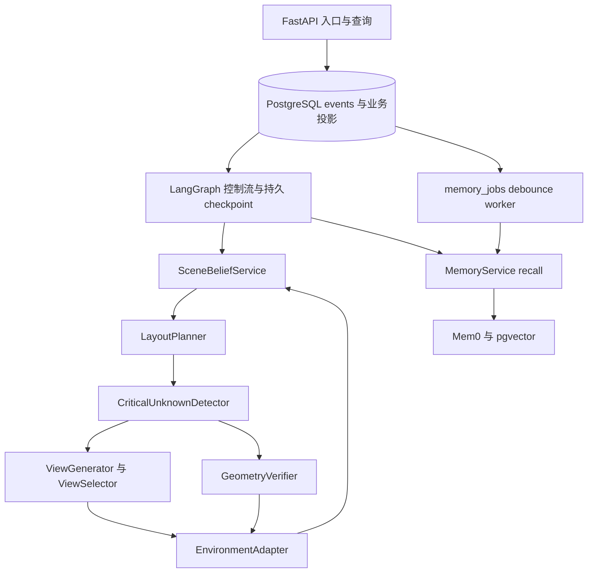

# RoomScout 架构合同

基线：《RoomScout 3D Agent 开发设计文档》v1.0，2026-09-07。完整阅读范围为正文、表格、20 节、附录 A/B 与架构图。初始仓库为空。本仓库当前已实现 V0 可运行基础设施与 Fake Agent 闭环，真实领域算法尚未实现。补全先记录于 [ADR 0001](adr/0001-contract-baseline.md)，后续改变合同必须先增加 ADR。

## 目标与边界

Partial Observation → Scene Belief → Candidate Layout → Decision-Critical Unknown → Task-Critical View Selection → New Observation → Belief Update → Replanning → Verification → Execute → Validate。

Memory 是跨任务的偏好、项目和经验；Scene Belief 是当前环境的版本化信念。记忆可影响软偏好或检查先验，不能作为当前物理事实的观测证据。未知空间不等于空闲空间；模型判断不等于确定性验证。第一阶段不接真实设备、不实现复杂 Mem0、概率融合、连续 SE(3) 优化或美学算法。

## 分层

FastAPI 不运行循环；runner 持有每任务 lease，协调 Event First 与 LangGraph。领域端口只接收结构化对象，不依赖 SQLAlchemy、LangGraph、仿真 SDK 或 Mem0。基础设施实现端口；依赖注入在后续 composition root 完成。LLM/VLM Adapter 校验结构化输出并保留模型、prompt、原始输出 artifact、seed/config 与 operation_id。

EnvironmentAdapter 隔离观测、移动、几何测量和执行。GeometryVerifier 负责确定性规则计算，环境端口提供几何证据/碰撞原始结果；不得由 LLM 生成 passed。仿真真值只进入隔离的评估器；若研究协议允许验证端使用完整真值，必须单独实验配置和报告，不能反流入规划模块。

## 控制流

understand_task → recall_memory → observe → update_belief → generate_layouts → find_unknowns。
存在会改变决策的未知且有预算：generate_views → select_view → move → observe → update_belief，重新生成/评估布局、未知与视角。
证据充分：verify。失败回 replan；unknown 回主动观察；无可达或有收益视角、预算耗尽、候选不足则 blocked。只有必要硬约束全部通过、假设已被足够证据支持且版本有效时 execute；随后新观察及 validate，验证执行效果后才 finished。执行失败/partial 重新观测，unknown 先 reconcile。没有自动“失败后仍执行”的分支。

## 一致性

用户请求事件提交后才调度。外部调用意图事件提交后才调用。外部结果及 observation 原件持久化后才进入融合。推理结果事件与投影同事务提交后才推进下个节点。checkpoint 独立提交，恢复先对齐事件游标，不把恢复等同于从头运行。模型返回非确定性输出也按 operation_id 留存复用。

明确不保证跨数据库、仿真器和 Mem0 的 exactly-once；采用 at-least-once + ledger/幂等/对账。详情见 [事件合同](EVENT_SCHEMA.md) 与 [数据库合同](DATABASE.md)。

## 可替换与复现

每个 run 固定 scenario/dataset 版本、初始视角、seed、config hash、规则/模型/prompt/adapter 版本及预算；记录观察 artifact 哈希。重放使用录制观测和模型响应，不调用真实外部服务。当前数据模型只定义可解释特征，不把 uncertainty 与 confidence 强制互补，不把 score 写成已校准概率。

## V0 运行实现

V0 已提供可运行 Compose 与 Fake 闭环。S0 的“仅合同”状态已结束；上述研究目标和模块边界保持。V0 适配详见 [ADR 0002](adr/0002-v0-runtime.md)：真实持久化与 checkpoint，Fake 环境/推理/验证，独立 DB polling runner，局部 entity_records 投影，Demo 认证和 session advisory lock。后续真环境不能照搬 Fake 的可重算假设。
